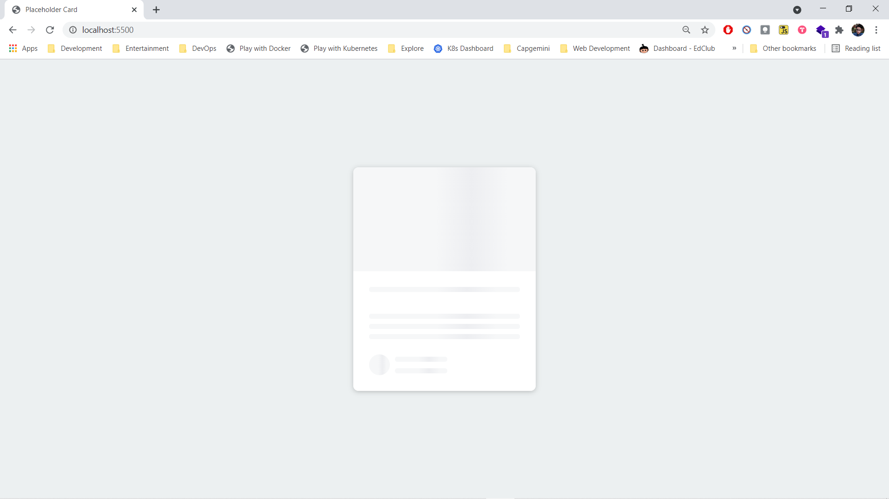
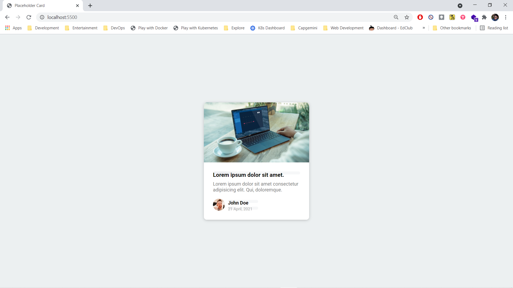

# Placeholder Card

- [Placeholder Card](#placeholder-card)
  - [Deployment](#deployment)
  - [Description](#description)
  - [Screenshots](#screenshots)

## Deployment

- Checkout deployment at <https://gagandeep39.github.io/css-placeholder-card/>

## Description

- Simple Card UI created Using HTML + CSS
- Provides a placeholder animation when contents are being fetched

## Screenshots

